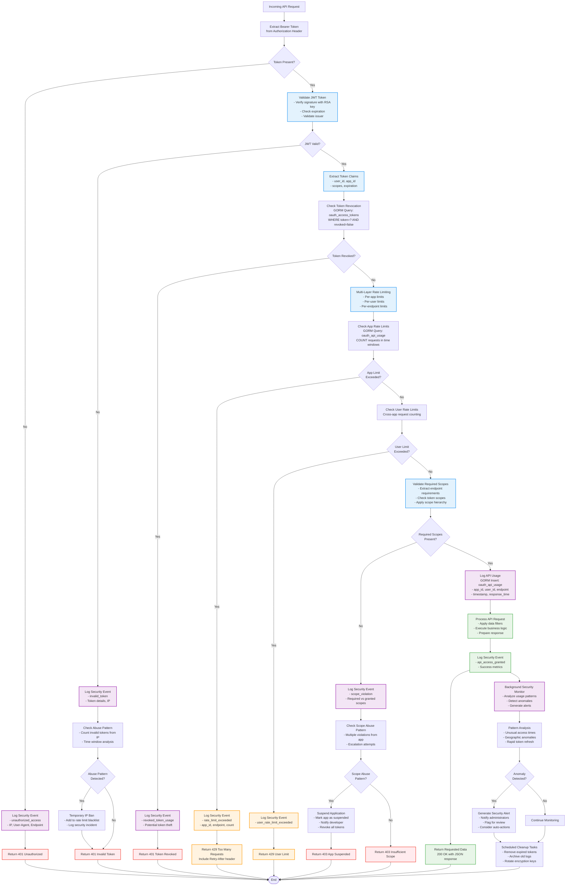

# OAuth Provider Security Analysis & Implementation Approach

## Security Threat Model

### Primary Attack Vectors

1. **Authorization Code Interception**
   - **Risk**: Malicious apps intercepting authorization codes
   - **Mitigation**: PKCE (Proof Key for Code Exchange) mandatory for all clients

2. **Token Theft & Replay**
   - **Risk**: Stolen access tokens used maliciously
   - **Mitigation**: Short-lived tokens (1 hour), secure storage recommendations

3. **Scope Escalation**
   - **Risk**: Apps accessing data beyond granted permissions
   - **Mitigation**: Strict scope validation on every API request

4. **Client Impersonation**
   - **Risk**: Malicious apps pretending to be legitimate ones
   - **Mitigation**: Client authentication, redirect URI validation

5. **Cross-Site Request Forgery (CSRF)**
   - **Risk**: Unauthorized actions on behalf of users
   - **Mitigation**: State parameter validation, CSRF tokens

## Security Data Flow Analysis

The following diagram illustrates how security validations, rate limiting, and audit logging work together to protect the OAuth provider from various attack vectors.



## Security Implementation Strategy

### 1. PKCE (Proof Key for Code Exchange) Implementation

```go
// PKCE Challenge Generation
type PKCEChallenge struct {
    CodeVerifier  string `json:"code_verifier"`
    CodeChallenge string `json:"code_challenge"`
    Method        string `json:"code_challenge_method"` // S256 or plain
}

func GeneratePKCEChallenge() (*PKCEChallenge, error) {
    // Generate 128-bit random code verifier
    verifier := base64.RawURLEncoding.EncodeToString(randomBytes(96))
    
    // Create SHA256 challenge
    hash := sha256.Sum256([]byte(verifier))
    challenge := base64.RawURLEncoding.EncodeToString(hash[:])
    
    return &PKCEChallenge{
        CodeVerifier:  verifier,
        CodeChallenge: challenge,
        Method:        "S256",
    }, nil
}
```

**Security Benefits:**
- Prevents authorization code interception attacks
- Mandatory for all OAuth flows (public and confidential clients)
- Uses SHA256 hashing for challenge generation

### 2. Token Security Architecture

#### Access Token Design
```go
type AccessTokenClaims struct {
    jwt.RegisteredClaims
    UserID    string   `json:"user_id"`
    AppID     string   `json:"app_id"`
    Scopes    []string `json:"scopes"`
    TokenType string   `json:"token_type"` // "access_token"
}

// Token Configuration
const (
    AccessTokenLifetime  = 1 * time.Hour
    RefreshTokenLifetime = 30 * 24 * time.Hour // 30 days
    MaxTokensPerUser     = 10 // Per app
)
```

#### Refresh Token Rotation
```go
type RefreshTokenRotation struct {
    // Old token is invalidated when new one is issued
    // Prevents token replay attacks
    // Detects token theft through rotation chain breaks
}
```

**Security Features:**
- **Short-lived access tokens** (1 hour) minimize exposure window
- **Refresh token rotation** prevents long-term token theft
- **Token binding** to specific client applications
- **Automatic revocation** on suspicious activity

### 3. Scope-Based Access Control (RBAC)

#### Scope Validation Middleware
```go
func RequireScopes(requiredScopes ...string) fiber.Handler {
    return func(c *fiber.Ctx) error {
        token := extractTokenFromRequest(c)
        if token == nil {
            return c.Status(401).JSON(fiber.Map{"error": "unauthorized"})
        }
        
        // Validate token signature and expiration
        claims, err := validateAccessToken(token)
        if err != nil {
            return c.Status(401).JSON(fiber.Map{"error": "invalid_token"})
        }
        
        // Check scope permissions
        if !hasRequiredScopes(claims.Scopes, requiredScopes) {
            return c.Status(403).JSON(fiber.Map{
                "error": "insufficient_scope",
                "required_scopes": requiredScopes,
            })
        }
        
        // Log API usage for analytics using GORM
        logAPIUsageWithGORM(claims.AppID, claims.UserID, c.Path(), c.Method())
        
        return c.Next()
    }
}
```

#### Scope Hierarchy & Validation
```go
var ScopeHierarchy = map[string][]string{
    "profile:write": {"profile:read"},
    "gamedata:write": {"gamedata:read"},
    "activity:write": {"activity:read"},
}

func hasRequiredScopes(userScopes, requiredScopes []string) bool {
    userScopeSet := make(map[string]bool)
    
    // Build user scope set including implied scopes
    for _, scope := range userScopes {
        userScopeSet[scope] = true
        // Add implied scopes (e.g., write implies read)
        if impliedScopes, exists := ScopeHierarchy[scope]; exists {
            for _, implied := range impliedScopes {
                userScopeSet[implied] = true
            }
        }
    }
    
    // Check if all required scopes are present
    for _, required := range requiredScopes {
        if !userScopeSet[required] {
            return false
        }
    }
    return true
}
```

### 4. Rate Limiting & Abuse Prevention

#### Multi-Layer Rate Limiting
```go
type RateLimitConfig struct {
    // Per-app limits
    AppRequestsPerMinute   int `json:"app_requests_per_minute"`
    AppRequestsPerHour     int `json:"app_requests_per_hour"`
    AppRequestsPerDay      int `json:"app_requests_per_day"`
    
    // Per-user limits (across all apps)
    UserRequestsPerMinute  int `json:"user_requests_per_minute"`
    UserRequestsPerHour    int `json:"user_requests_per_hour"`
    
    // Per-endpoint limits
    EndpointRequestsPerMinute int `json:"endpoint_requests_per_minute"`
}

var DefaultRateLimits = RateLimitConfig{
    AppRequestsPerMinute:      100,
    AppRequestsPerHour:        5000,
    AppRequestsPerDay:         50000,
    UserRequestsPerMinute:     50,
    UserRequestsPerHour:       1000,
    EndpointRequestsPerMinute: 200,
}
```

#### Abuse Detection System
```go
type AbuseDetector struct {
    // Suspicious patterns
    HighErrorRateThreshold    float64 // >50% error rate
    RapidTokenRefreshPattern  int     // >10 refreshes/hour
    UnusualScopeRequestPattern bool   // Requesting all scopes
    
    // Actions
    TemporaryBan    time.Duration // 1 hour
    PermanentBan    bool
    NotifyDeveloper bool
}
```

### 5. Client Application Security

#### Client Registration Validation
```go
type ClientValidation struct {
    RedirectURIValidation struct {
        RequireHTTPS      bool     `json:"require_https"`
        AllowedDomains    []string `json:"allowed_domains"`
        BlockedDomains    []string `json:"blocked_domains"`
        RequireDomainMatch bool    `json:"require_domain_match"`
    }
    
    ClientSecretRequirements struct {
        MinLength         int  `json:"min_length"`
        RequireComplexity bool `json:"require_complexity"`
        RotationRequired  bool `json:"rotation_required"`
    }
}
```

#### Redirect URI Security
```go
func validateRedirectURI(registeredURIs []string, requestedURI string) error {
    // Exact match required - no wildcards
    for _, registered := range registeredURIs {
        if registered == requestedURI {
            return nil
        }
    }
    
    // Additional security checks
    if !strings.HasPrefix(requestedURI, "https://") {
        return errors.New("redirect URI must use HTTPS")
    }
    
    if strings.Contains(requestedURI, "localhost") && os.Getenv("APP_ENV") != "dev" {
        return errors.New("localhost redirect URIs not allowed in production")
    }
    
    return errors.New("redirect URI not registered")
}
```

### 6. Cryptographic Security

#### Key Management
```go
type KeyManager struct {
    SigningKey    *rsa.PrivateKey // For JWT signing
    EncryptionKey []byte          // For sensitive data encryption
    KeyRotation   time.Duration   // 90 days
}

// JWT Signing with RS256
func signJWT(claims jwt.Claims, key *rsa.PrivateKey) (string, error) {
    token := jwt.NewWithClaims(jwt.SigningMethodRS256, claims)
    return token.SignedString(key)
}

// Sensitive data encryption (client secrets, refresh tokens)
func encryptSensitiveData(data string, key []byte) (string, error) {
    block, err := aes.NewCipher(key)
    if err != nil {
        return "", err
    }
    
    gcm, err := cipher.NewGCM(block)
    if err != nil {
        return "", err
    }
    
    nonce := make([]byte, gcm.NonceSize())
    if _, err := io.ReadFull(rand.Reader, nonce); err != nil {
        return "", err
    }
    
    ciphertext := gcm.Seal(nonce, nonce, []byte(data), nil)
    return base64.StdEncoding.EncodeToString(ciphertext), nil
}
```

### 7. Audit Logging & Monitoring with GORM

#### Security Event Logging Model
```go
// GORM model for security events
type SecurityEvent struct {
    ID          uuid.UUID              `gorm:"type:uuid;primary_key;default:uuid_generate_v4()" json:"id"`
    Timestamp   time.Time              `gorm:"not null;index" json:"timestamp"`
    EventType   string                 `gorm:"size:50;not null;index" json:"event_type"`
    Severity    string                 `gorm:"size:20;not null" json:"severity"`
    UserID      *uuid.UUID             `gorm:"type:uuid;index" json:"user_id,omitempty"`
    AppID       *uuid.UUID             `gorm:"type:uuid;index" json:"app_id,omitempty"`
    IPAddress   string                 `gorm:"type:inet" json:"ip_address"`
    UserAgent   string                 `gorm:"type:text" json:"user_agent"`
    Details     datatypes.JSON         `gorm:"type:jsonb" json:"details"`
    CreatedAt   time.Time              `json:"created_at"`
    
    // Relationships
    User        *User                  `gorm:"foreignKey:UserID" json:"user,omitempty"`
    App         *OAuthApp              `gorm:"foreignKey:AppID" json:"app,omitempty"`
}

// Security events to log
const (
    EventTokenIssued        = "token_issued"
    EventTokenRevoked       = "token_revoked"
    EventScopeViolation     = "scope_violation"
    EventRateLimitExceeded  = "rate_limit_exceeded"
    EventSuspiciousActivity = "suspicious_activity"
    EventClientRegistered   = "client_registered"
    EventAuthorizationGranted = "authorization_granted"
)

// GORM-based security event logging
func LogSecurityEvent(db *gorm.DB, eventType, severity string, userID, appID *uuid.UUID, ipAddress, userAgent string, details map[string]interface{}) error {
    event := SecurityEvent{
        Timestamp: time.Now(),
        EventType: eventType,
        Severity:  severity,
        UserID:    userID,
        AppID:     appID,
        IPAddress: ipAddress,
        UserAgent: userAgent,
        Details:   datatypes.JSON(details),
    }
    
    return db.Create(&event).Error
}
```

#### Real-time Security Monitoring with GORM
```go
type SecurityMonitor struct {
    DB *gorm.DB
    
    AlertThresholds struct {
        FailedAuthAttempts    int           `json:"failed_auth_attempts"`
        TimeWindow           time.Duration `json:"time_window"`
        ScopeViolations      int           `json:"scope_violations"`
        RateLimitViolations  int           `json:"rate_limit_violations"`
    }
    
    NotificationChannels struct {
        Email    []string `json:"email"`
        Webhook  []string `json:"webhook"`
        Slack    string   `json:"slack"`
    }
}

// GORM-based security monitoring queries
func (sm *SecurityMonitor) CheckFailedAuthAttempts(userID uuid.UUID, timeWindow time.Duration) (int64, error) {
    var count int64
    err := sm.DB.Model(&SecurityEvent{}).
        Where("user_id = ? AND event_type = ? AND timestamp > ?",
              userID, "auth_failed", time.Now().Add(-timeWindow)).
        Count(&count).Error
    return count, err
}

func (sm *SecurityMonitor) CheckScopeViolations(appID uuid.UUID, timeWindow time.Duration) (int64, error) {
    var count int64
    err := sm.DB.Model(&SecurityEvent{}).
        Where("app_id = ? AND event_type = ? AND timestamp > ?",
              appID, EventScopeViolation, time.Now().Add(-timeWindow)).
        Count(&count).Error
    return count, err
}

// API usage logging with GORM
func logAPIUsageWithGORM(db *gorm.DB, appID, userID string, endpoint, method string) {
    usage := OAuthAPIUsage{
        AppID:          uuid.MustParse(appID),
        UserID:         func() *uuid.UUID { id := uuid.MustParse(userID); return &id }(),
        Endpoint:       endpoint,
        Method:         method,
        StatusCode:     200, // This would be set from the actual response
        ResponseTimeMs: 0,   // This would be calculated from request timing
        CreatedAt:      time.Now(),
    }
    
    db.Create(&usage)
}
```

### 8. CORS & Web Security

#### CORS Configuration
```go
func configureCORS() fiber.Handler {
    return cors.New(cors.Config{
        AllowOrigins: getAllowedOrigins(), // From registered redirect URIs
        AllowMethods: []string{"GET", "POST", "PUT", "DELETE", "OPTIONS"},
        AllowHeaders: []string{
            "Origin", "Content-Type", "Accept", "Authorization",
            "X-Requested-With", "X-CSRF-Token",
        },
        AllowCredentials: true,
        MaxAge:          86400, // 24 hours
    })
}
```

#### Security Headers
```go
func securityHeaders() fiber.Handler {
    return func(c *fiber.Ctx) error {
        c.Set("X-Content-Type-Options", "nosniff")
        c.Set("X-Frame-Options", "DENY")
        c.Set("X-XSS-Protection", "1; mode=block")
        c.Set("Strict-Transport-Security", "max-age=31536000; includeSubDomains")
        c.Set("Content-Security-Policy", "default-src 'self'")
        c.Set("Referrer-Policy", "strict-origin-when-cross-origin")
        return c.Next()
    }
}
```

## Implementation Priority & Risk Assessment

### High Priority (Critical Security)
1. **PKCE Implementation** - Prevents code interception
2. **Token Validation Middleware** - Core security mechanism
3. **Scope Enforcement** - Prevents unauthorized data access
4. **Rate Limiting** - Prevents abuse and DoS

### Medium Priority (Enhanced Security)
1. **Audit Logging** - Security monitoring and compliance
2. **Client Validation** - Prevents malicious app registration
3. **Abuse Detection** - Automated threat response
4. **Key Rotation** - Long-term security maintenance

### Low Priority (Defense in Depth)
1. **Advanced Analytics** - Behavioral analysis
2. **Webhook Security** - Secure notifications
3. **Export Security** - Data protection in exports
4. **SDK Security** - Client-side security guidance

## Security Testing Strategy

### Automated Security Tests with GORM
1. **Token Validation Tests** - Invalid/expired/malformed tokens with GORM token lookups
2. **Scope Violation Tests** - Unauthorized access attempts with GORM authorization checks
3. **PKCE Flow Tests** - Code challenge validation with GORM code storage
4. **Rate Limiting Tests** - Abuse scenario simulation with GORM usage tracking
5. **Database Security Tests** - GORM model validation and constraint testing

### Manual Security Review
1. **Threat Modeling** - Attack vector analysis including database-level threats
2. **Code Review** - Security-focused code inspection including GORM usage patterns
3. **Penetration Testing** - External security assessment
4. **Compliance Audit** - OAuth 2.0 specification compliance
5. **Database Security Audit** - GORM model security and data protection review

## Deployment Security Checklist

- [ ] RSA keys generated and securely stored
- [ ] Environment variables configured (no secrets in code)
- [ ] HTTPS enforced for all OAuth endpoints
- [ ] Rate limiting configured per environment with GORM tracking
- [ ] Audit logging enabled with GORM security event models
- [ ] Security headers configured
- [ ] CORS properly configured
- [ ] Database encryption at rest enabled
- [ ] Backup encryption configured
- [ ] GORM migrations run with proper constraints and indexes
- [ ] Database connection security configured (SSL, connection limits)
- [ ] GORM model validations and hooks implemented
- [ ] Monitoring and alerting set up with GORM-based metrics

This security analysis provides a comprehensive approach to implementing a secure OAuth provider that protects against common attack vectors while maintaining usability for legitimate developers and users.